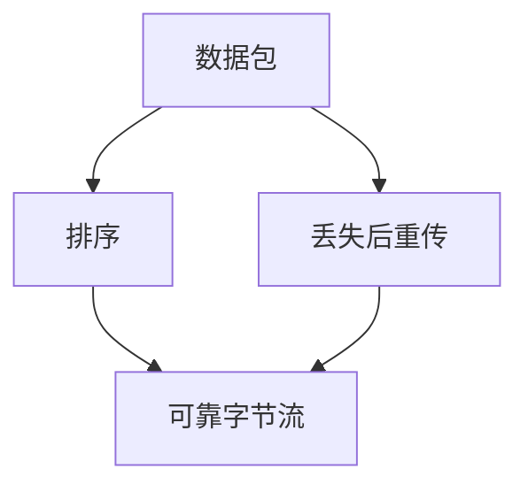

# Visualize

A picture earns its place only when it shows something words can't — shape, structure, direction, relationship, geometry. This skill produces ONE such visual and embeds it in the lesson's Markdown.

You are the **creative director**. You decide the exact idea and distill it to its fewest carrying elements. For structural visuals, a **maker subagent** reviews the relationships and syntax, then returns Mermaid source that you embed directly. The Markdown viewer performs rendering; source review does not guarantee the final layout. The optional SVG path renders and visually verifies a PNG when its tools are already available.

## When to visualize (and when not to)

This teaching system builds a **dependency graph in the learner's head** — axioms at the root, derived facts hanging off them. A visual is powerful exactly when it makes that structure (or a geometry) visible. Reach for one when:

- The idea is a **structure or relationship**: dependencies, a system with parts and arrows, a flow/pipeline, a sequence of exchanges, a state machine, a tree/hierarchy, a comparison, a containment (what's inside vs outside).
- The idea is **spatial or geometric**: coordinate geometry, a number line, vectors, a function's shape, a physical arrangement.

Do NOT visualize when prose or a single equation already carries it. A decorative diagram that just restates the sentence next to it adds noise and a chance to be wrong. When in doubt, don't — a missing visual is cheaper than a false one.

## Choose the maker

Two makers, discovered from `.pi/agents/`:

- **`mermaid-maker`** — structural/relational visuals: dependency graphs, flowcharts, sequence/state/ER/class diagrams, trees, mindmaps, timelines. This is the default. It returns a fenced `mermaid` code block and needs no custom extension tools or installed renderers.
- **`svg-maker`** — spatial/geometric visuals Mermaid can't lay out: exact coordinates, geometry figures, number lines, vectors, plots, custom shapes. This optional path needs its existing authoring and rendering tools. If they are unavailable, explain the geometry in prose or equations; do not install tools or force inaccurate geometry into Mermaid.

Rule of thumb: if it's *nodes-and-edges / relationships*, use mermaid-maker. If it's *positions-and-shapes / geometry*, use svg-maker.

## Brief the maker well: one idea, fewest elements

The most common failure is **cramming** — every extra label makes the picture harder to read AND harder to lay out correctly. Before briefing, prune to the fewest elements that carry the idea, and for each ask: *"if I delete this, is the idea still clear?"* If yes, delete it.

Give the maker the concept AND the concrete elements you want — not a vague topic, and not a long checklist.

- BAD: "make a diagram about how TCP works"
- GOOD: "graph TD: a node 'packet' at the top; arrows down to 'ordering' and 'retransmit on loss'; both arrows down into 'reliable stream'. No title. Show that reliability is built FROM packets, not alongside them."

Keep the idea intact but trust the maker to compose; if your brief lists more than ~5–7 elements, cut it first.

## Invoke with pi-subagents

`pi-subagents` discovers the maker definitions in `.pi/agents/`; no custom tool-registration hook is needed for Mermaid. Confirm the selected agent is executable with `subagent({ action: "list", capabilities: true })`, then dispatch it:

```json
{
  "agent": "mermaid-maker",
  "task": "<your minimal, concrete brief; request one fenced mermaid code block>",
  "async": true
}
```

Background runs notify the parent when complete. Continue independent work or yield while the maker runs; embed the diagram only after receiving its result. Do not poll or launch a duplicate maker to wait for it.

On success, `mermaid-maker` returns exactly one fenced `mermaid` code block. It reviews source and relationships; it does not create a PNG, save files, or use `write_mermaid`, `edit_mermaid`, or `render_mermaid`. Do not install renderers or other dependencies for this path.

For optional SVG work, dispatch `svg-maker` only when its authoring and rendering tools are available. It renders a PNG, looks at it, iterates, and publishes it with this result:

```text
RESULT:
filename: viz-<slug>-<timestamp>.png
path: <cwd>/viz/viz-<slug>-<timestamp>.png
```

If either maker returns `RESULT: NONE`, simplify or rethink the brief, or explain without a visual. A missing-tool or launch error is an infrastructure failure, not proof that the idea cannot be visualized. Report it explicitly. Do not fabricate code, filenames, or verified images to stand in for a failed maker.

## Embed it in the lesson

For **Mermaid**, copy the returned fenced code block directly into the teaching reply, without a surrounding code fence, indentation, `RESULT:` wrapper, or wikilink. For example:



The `md-log` extension mirrors the reply into the linked `.md` file. Obsidian and other Mermaid-enabled Markdown viewers render the code block inline. Introduce the diagram in a sentence, then let it carry the idea. Do not claim it was rendered or visually verified by the maker.

For **SVG PNGs**, use the returned filename with an Obsidian embed:

```text
![[viz-<slug>-<timestamp>.png|500]]
```

Obsidian resolves the unique filename inside the vault's `viz` folder. Use larger display widths only when needed.

## Verification boundary

- Mermaid: the maker checks source syntax and meaning by review. The viewer owns parsing and layout. If the viewer reports an error, send the exact error and source back to the maker for correction.
- SVG: the maker's existing render-and-inspect loop verifies the published PNG. This path still depends on the SVG tools and an installed renderer.
